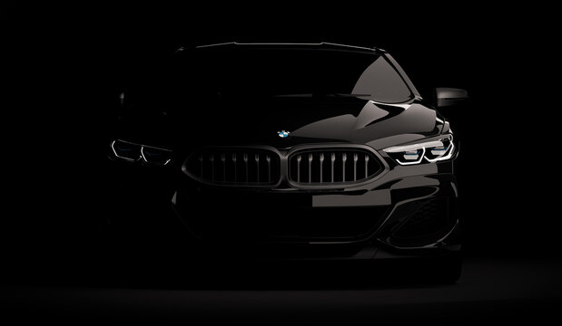

# 🚗 BMW Worldwide Car Sales (2010–2024) — EDA Dashboard

<p align="center">
  
</p>

A **Streamlit-powered interactive dashboard** for exploring BMW’s worldwide car sales trends between **2010 and 2024**.  
The app performs end-to-end **Exploratory Data Analysis (EDA)** — visualizing sales patterns, regional performance, color preferences, fuel trends, and engine size impacts.

---

## 📘 Project Overview

This project analyzes BMW’s global car sales dataset obtained from Kaggle and presents insights through an interactive dashboard.  
It focuses on understanding sales patterns by:
- **Year** (2010–2024)
- **Model type**
- **Color**
- **Transmission type**
- **Fuel type**
- **Region**
- **Engine size**

---

## ✨ Key Features

✅ Interactive data exploration with **Streamlit**  
✅ Beautiful **background and dark-themed tables** for readability  
✅ Automated **data loading from KaggleHub**  
✅ Univariate and Bivariate Analysis  
✅ Regional and model-specific breakdowns  
✅ Focused analysis on **BMW i3 in the Asia region**  
✅ Engine size categorization into **small**, **mid-size**, and **big engines**  
✅ Business insights and recommendations  

---

## 🗂️ Dataset Source

**Kaggle Dataset:**  
📦 [BMW Worldwide Sales Records (2010–2024)](https://www.kaggle.com/datasets/ahmadrazakashif/bmw-worldwide-sales-records-20102024)

**Columns Overview:**
| Column Name | Description |
|--------------|-------------|
| `Year` | Year of sale (2010–2024) |
| `Model` | BMW car model (e.g., X5, i3, 3 Series) |
| `Color` | Color of the car sold |
| `Transmission` | Manual or Automatic |
| `Fuel_Type` | Petrol, Diesel, Hybrid, Electric |
| `Region` | Continent or sales region |
| `Engine_Size_L` | Engine size in liters |
| `Sales_Volume` | Number of cars sold |
| `Mileage_KM` | Mileage (removed in analysis) |

---

## 🧠 Insights & Recommendations

### 📋 Key Findings
1. Sales volume is roughly consistent across global regions.  
2. In **Asia**, the **BMW i3** model shows the lowest sales.  
3. **Black** and **Grey** cars dominate sales trends.  
4. **Manual transmission** models show more stable demand.  
5. **Petrol variants** have a noticeable decline after 2020.  
6. **Hybrid mid-size engines** have grown strongly post-2021.  

### 💡 Recommendation
> To boost **BMW i3** sales in Asia, focus on producing **Black or Grey cars**  
> with **Manual transmission** and **Mid-size engines**, while **avoiding petrol variants**.

---

## ⚙️ Installation & Setup

### 1️⃣ Clone the Repository
```bash
git clone https://github.com/yourusername/BMW-Car-Sales-EDA.git
cd BMW-Car-Sales-EDA
